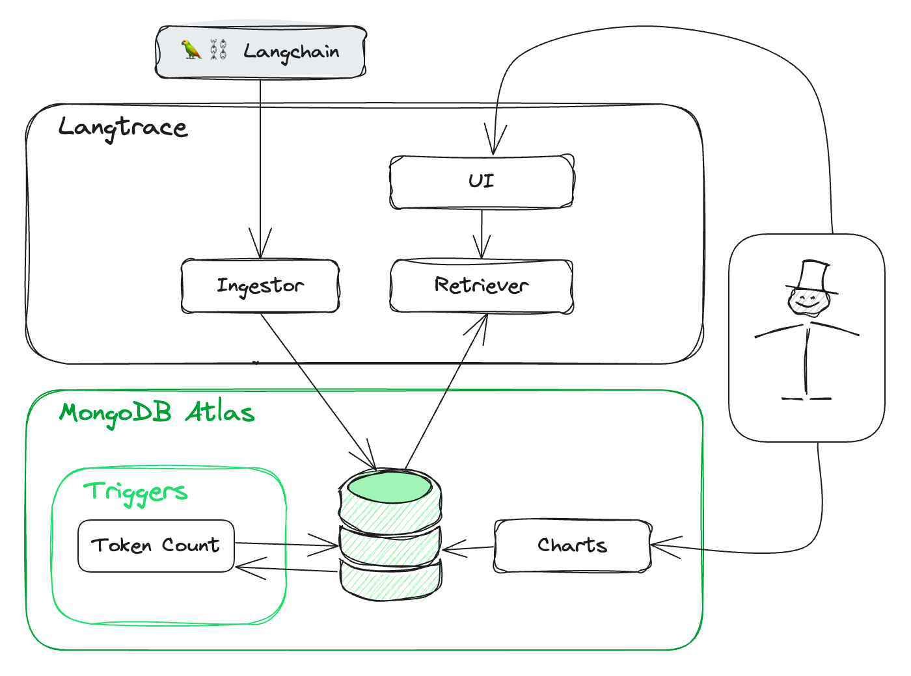
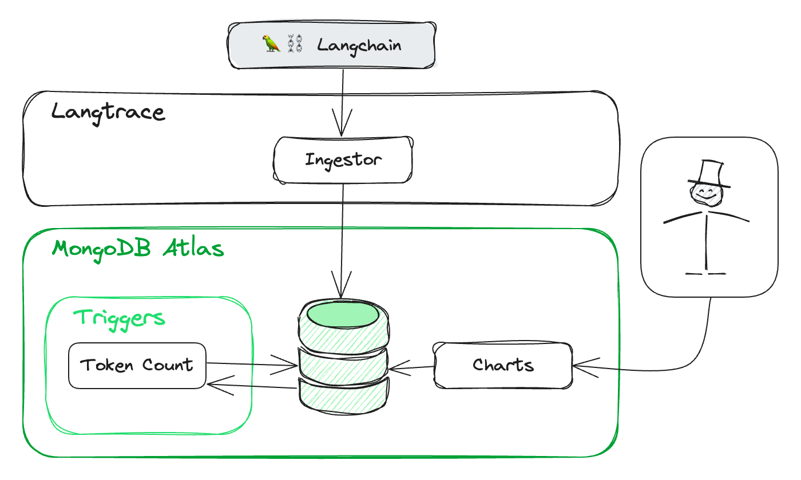

#  

<div align="center">


</div>
<div align="center">
   <div>
      <a href="https://github.com/CapgeminiInventUK/langscout/issues/new?labels=bug">
         <strong>Report Bug</strong>
      </a> ·
      <a href="https://github.com/CapgeminiInventUK/langscout/discussions/new?category=ideas">
         <strong>Ideas</strong>
      </a> ·
      <a href="https://discord.gg/VH95CUQHqH">
         <strong>Discord</strong>
      </a> 
   </div>
</div>

## Contents

- [Overview](#overview)
- [Current Features](#current-features)
- [Running Modes](#running-modes)
- [Setup MongoDB Atlas](#setup-mongodb-atlas)
- [Running Services](#running-services)
- [Running Services (development)](#running-services-development)

## Overview

Langscout is an LLM tracing tool that consumes the data from Langchain and saves the data to
MongoDB allowing for easy querying and visualization of the data through either the UI or MongoDB
Atlas Charts.

It is built using Next.js, Node.js 20, Typescript and MongoDB Atlas.

## Current Features

- Ingests trace data from Langchain/Langsmith
- Handles feedback creation and updating
- UI to view trace data
- UI authentication providers (Github, Microsoft AD)
- MongoDB Trigger to add token usage data to the trace data

### Limitations

- Assumes all project names set in LANGCHAIN_PROJECT are URL safe, as they are used in the URL
    - No need to register projects, they are automatically created when data is ingested
- No API key required for ingestion or querying

## Running Modes

Langscout can be run in two modes: [Full Mode](#full-mode) and [Headless Mode](#headless-mode). Full
mode runs the UI
and APIs together.

Headless mode runs the ingestion api only

### Full Mode

This will start 3 services:

- UI
- Langscout API (backend for the UI)
- Ingest Server



### Headless Mode

This will start 1 service:

- Ingest Server

It's assumed to view data you will use MongoDB Atlas Charts



## Setup MongoDB Atlas

- [Create/Provision cluster in MongoDB Atlas](#createprovision-cluster-in-mongodb-atlas)
- [Setup Functions for automated token usage data](#setup-functions-for-automated-token-usage-data)

### Create/Provision cluster in MongoDB Atlas

- Create/Provision cluster in [MongoDB Atlas](https://www.mongodb.com/cloud/atlas)
- Create a database in the cluster and set LANGSCOUT_MONGODB_DB_NAME to the name of the database
  in the .env file in /server. Example langscout
- Create a collection in the database and set LANGSCOUT_TRACES_MONGODB_COLLECTION_NAME to the name
  of the collection
  in the .env file in /server. Example traces
- Create a readWrite user for the trace collection and setup a connection string for that user on
  LANGSCOUT_INGEST_MONGODB_URI
- Create a readOnly user for the trace collection and setup a connection string for that user on
  LANGSCOUT_API_MONGODB_URI

### Setup Functions for automated token usage data

> MongoDB Atlas required for this feature. If you are using MongoDB outside of Atlas you will
> need to handle the updates separately.

Example of a function to add token usage data to the trace data
in `./atlas/functions/add-token-usage.js`

Create a trigger in MongoDB Atlas to run the function on the traces collection (
LANGSCOUT_TRACES_MONGODB_COLLECTION_NAME)

#### Steps in UI

- In the MongoDB Atlas UI, navigate to Triggers
- Create a new trigger
- Select the cluster and database
- Select the collection
- Set Operation Type to Insert and Update
- In advanced settings set the following:
    - Match Expression:
    ```json
    {
      "fullDocument.run_type": "llm",
      "fullDocument.end_time": {
        "$exists": true,
        "$ne": null
      },
      "fullDocument.extra.tokens": {
        "$exists": false
      },
      "fullDocument.outputs.generations": {
        "$exists": true,
        "$ne": null
      },
      "fullDocument.inputs.messages": {
        "$exists": true,
        "$ne": null
      }
    }   
    ```

    - Project Expression:
    ```json
    {
      "fullDocument.end_time": 1,
      "fullDocument.run_type": 1,
      "fullDocument.outputs.generations": 1,
      "fullDocument.extra.invocation_params.model": 1,
      "fullDocument.inputs.messages": 1,
      "ns.coll": 1,
      "documentKey._id": 1,
      "operationType": 1
    }
    ```
- Got to function and select the function you created and paste the code from the function file
  ./atlas/functions/add-token-usage.js
- Repeat process for add-latency.js
  - Match
    ```json5
    {
      "fullDocument.run_type": "llm",
      "fullDocument.end_time": {
        "$exists": true,
        "$ne": null
      },
      "fullDocument.latency": {
        "$exists": false
      }
    }
    ```
  - Project
    ```json5
    {
      "fullDocument.end_time": 1,
      "fullDocument.run_type": 1,
      "fullDocument.latency": 1,
      "ns.coll": 1,
      "documentKey._id": 1,
      "operationType": 1
    }
    ```
- Go to Triggers and Dependencies in MongoDB Atlas and add `js-tiktoken-mongodb` version 0.0.3
- Finally, you need to add the encoding for tokens to a new table called `encoding` in the same
  database `LANGSCOUT_TRACES_MONGODB_COLLECTION_NAME`. Import the file `./atlas/encoding.json` to
  that table

#### Steps in atlas app service CLI

> Assumes you have an existing project configured for defining you Atlas infrastructure

- Install the [MongoDB Atlas CLI](https://www.mongodb.com/docs/atlas/app-services/cli/)
- Copy the contents of ./atlas/functions/ into the functions folder in your project
- Copy the contents of ./atlas/trigger/ into the trigger folder in your project
- In the trigger file set the following fields
    - `service-name` - the name of your service
    - `database` - the name of your database (if different from langscout)
    - `collection` - the name of your collection (if different from traces)
      For further information on configuration see the [Trigger Configuration Files documentation]
      (https://www.mongodb.com/docs/atlas/app-services/reference/config/triggers/)
- Deploy changes

## Running Services

- [Prerequisites](#prerequisites)
- [Configuration](#configuration)
- [Running via Docker](#running-via-docker)

### Prerequisites

- MongoDB (some features like token usage currently depends on MongoDB Atlas)
  see [Setup MongoDB](#setup-mongodb-atlas)
- Langchain application (see [Langchain Configuration](#langchain-configuration))
- Docker & Docker Compose

### Configuration

- In ./ui copy .env.example to .env and set the values
- In ./server copy .env.example to .env and set the values

#### Langchain Configuration

> Note: Langscout is currently configured to use the `langsmith-sdk`.

- Add Langsmith dependency to your Langchain app
    - `pip install langsmith` or `npm i langsmith`
- Add the following VARs to your Langchain app
    - `LANGCHAIN_TRACING_V2` - set to `true`
    - `LANGCHAIN_ENDPOINT` - the URL of your Langscout API
    - `LANGCHAIN_PROJECT` - the name of your project

### Running via Docker

#### Options

- [Full Mode](#docker-compose---full-mode)
- [Headless Mode](#docker-compose---headless-mode)

##### Docker Compose - Full Mode

```bash
docker-compose up --build -f docker-compose.full.yml
```

##### Docker Compose - Headless Mode

```bash
docker-compose up --build -f docker-compose.headless.yml
```

## Running Services (development)

- [Prerequisites](#development-prerequisites)
- [Configuration](#development-configuration)
- [Running the Services](#running-the-services)
  - [UI](#ui)
  - [Ingest Server](#ingest-server)
  - [Langscout API](#langscout-api)

### Development Prerequisites

- Node.js (tested on 20)
- MongoDB (some features like token usage currently depends on MongoDB Atlas)
  see [Setup MongoDB](#setup-mongodb-atlas)
- Langchain application (see [Langchain Configuration](#langchain-configuration))

### Development Configuration

- In ./packages/ui copy .env.example to .env and set the values
- In ./packages/api copy .env.example to .env and set the values
- In ./packages/ingest copy .env.example to .env and set the values

### Running the services

Install the dependencies:

```bash
npm install
```

##### UI

```bash
npm run dev --workspace=@langscout/ui
```

##### Langscout API

This is the API that the UI uses to get data from MongoDB

```bash
npm run dev --workspace=@langscout/api

```

##### Ingest Server

This is the server that listens for data from Langchain

```bash
npm run dev --workspace=@langscout/ingest
```


